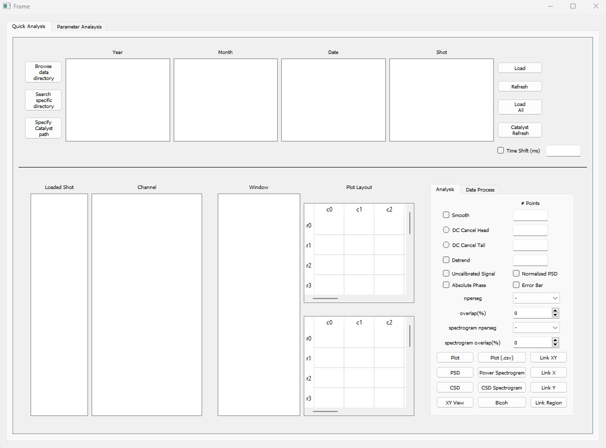

# dataViz

## How to use this application
1. Run the python file "dataViz/run.py". The main application window
   should appear.
2. Click "Browse data directory" and choose the directory of choice
   containing the data. This directory can be an overall directory or
year, month, or data subdirectories. For example, you can either choose
"sample_data", "sample_data/2006", "sample_data/2006/01_January", or "sample_data/2006/01_January/2016_01_08". Depending on the choice, the application will list the subdirectories available.
3. Choose the subdirectory by double-clicking the option. You can always
   choose a different dictories by double-clicking, and the
subdirectories will be updated. 
4. Once you choose the date directory, the application will list the
   shots. Select one or more shots and click "Load".

## Simple plot
1. Choose shot(s) in the "Loaded Shot" list and the channel(s) in the
   "Channel" list, and click "Plot" button. A window will appear with
the plot. 
2. You can specify the parameters such as smoothing, DC cancel, and so
   on. 
3. All the channels chosen will be plotted together. 
4. If you wish to plot different data in a different plot on the same
   window, choose the window in the "Window" list and select a blank
cell in the "Plot Layout", before clicking "Plot". 
5. Different plots can be synchronize in the X-, Y-, or both axes by
   selecting them in the "Plot Layout" and clicking "Link X", "Link Y",
or "Link XY", respectively.

## Power spectral density
1. Choose a shot and a channel and click "PSD". A PSD and raw signal
   will be plotted. 
2. You can change the region to perform PSD by changing the region of
   interest in the raw data plot.
3. Parameters can also be changed, such as detrend, nperseg, and
   overlap.

<video width="640" height="360" controls>
  <source src="./images/psd.mp4" type="video/mp4">
  Example of analyzing power spectral density.
</video>

## Cross spectral density
1. Choose a shot and two channels and click "CSD". Cross spectral
   density, coherence, phase, and raw data will be displayed. 
2. You can change the region by adjusting the region of interest in the
   raw data.
  
   

